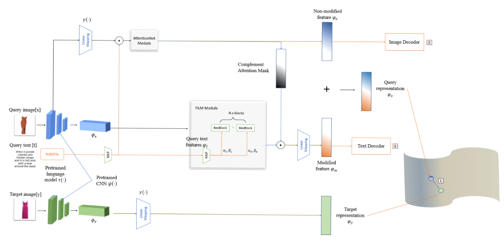

# Composed-Image-Retrieval
This reposity contain implementation of our research in Composed Image Retrieval task

## Introduction
Image retrieval systems have seen considerable advances in the last decade, with progress primarily focuses on text-based and content-based methods. However, the inputs to these systems are mainly uni-model, queries are expressed as either texts or images, leaving little to no works are done in the situation of multi-model inputs. This work considers the problem of retrieving images where the input is a combination of texts and images.

Our model is composed of FiLM module and Stack Attention Network. Its architecture:

## Folder Architecture [From ComposeAE]((https://github.com/ecom-research/ComposeAE)
we use the same train & test protocol as TIRG and [ComposeAE](https://github.com/ecom-research/ComposeAE) code. 
- main.py: driver script to run training/testing
- datasets.py: Dataset classes for loading images & generate training retrieval queries
- text_model.py: LSTM model to extract text features
- img_text_composition_models.py: various image text compostion models
- torch_function.py: contains soft triplet loss function and feature normalization function
- test_retrieval.py: functions to perform retrieval test and compute recall performance

main.py: driver script to run training/testing
datasets.py: Dataset classes for loading images & generate training retrieval queries
text_model.py: LSTM model to extract text features
img_text_composition_models.py: various image text compostion models
torch_function.py: contains soft triplet loss function and feature normalization function
test_retrieval.py: functions to perform retrieval test and compute recall performance

To download dataset and run the code, please check out [ComposeAE](https://github.com/ecom-research/ComposeAE) for more details.

